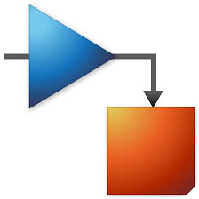
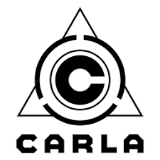

## Skills

### Modeling & Control

  
  &nbsp;
  
  &nbsp;
  
  &nbsp;
  
  &nbsp;
  

### Embedded & Robotics

  
  &nbsp;
  
  &nbsp;
  
  &nbsp;
  
  &nbsp;
  
  &nbsp;
  
  &nbsp;
  

### Programming

  
  &nbsp;
  
  &nbsp;
  
  &nbsp;
  
  &nbsp;
  
  &nbsp;
  

---

> 🚧 **This profile is under construction** — more coming soon.